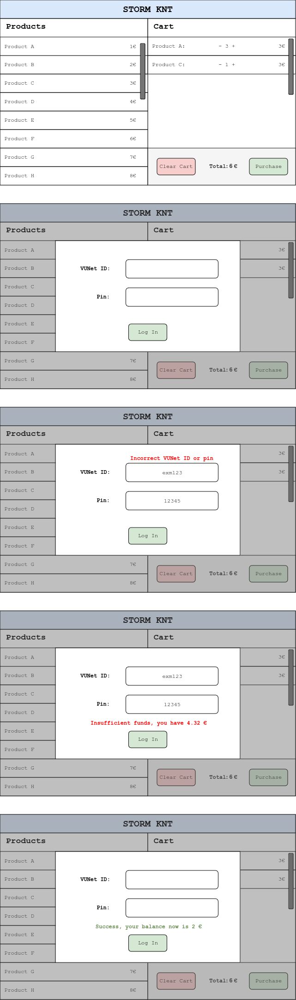

# Backend 
The backend is developed in go, to run use `\knt-backend\start-backend.sh` script (please install go on your system for the script, thank you). It runs in docker container and databse is made with SQLite 3.

We are blessed with the API documentation for the backend which can be found in `\docs\knt-backend-doc.yml`. Use swagger to view it.
# Frontend
Frontend is going to be as simple as possible - one page with either modal for login or a separate section for puting in you credentials once done adding products to cart.

Requirements:
1. Display the product names and prices on the page.
2. Display products added to the cart with + and - for quantity, price per line of product, and total price calculated bellow.
3. *IMPORTANT* add a button to remove everyting from the cart, to not delete everything individually.
4. Have a purchase button that calls modal that asks user for their login credentials. Those are two input fields: username, pin-password.
5. When authentication fails display to the user.
6. When there is not enough credits show the user how much they have and do not allow to purchase.
7. On success clear the input fields and display to the user how much money are left after the purchase.   

## Technology 
We use [Materialize](https://materializecss.com/) for the frontend, so make sure to check out their documentation.

Additionally, we use noopsTM for DevOps.

